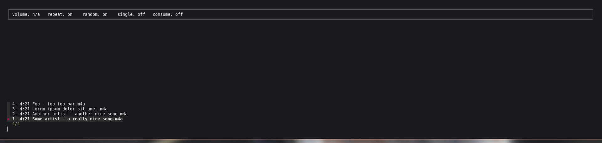
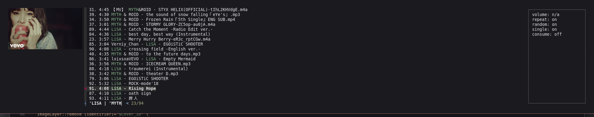
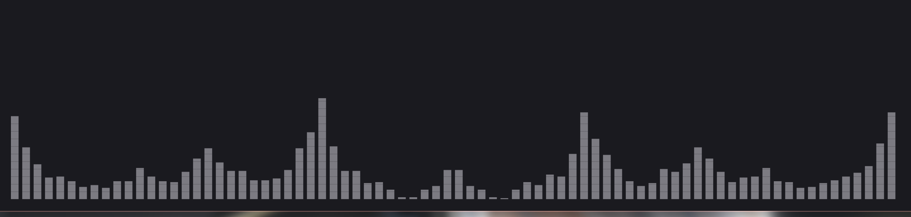

# FMUI

**f**zf **m**pd **u**ser **i**nterface  
Warning: FMUI will add every song to your queue by default.

## Overview

- [Unofficial aur package](#unofficial-aur-package)
- [Required uncommon programs](#required-uncommon-programs)
- [Config](#config)
  * [General configuration](#general-configuration)
  * [Cover images](#cover-images)
  * [Keybindings](#keybindings)
    - [Default keybindings](#default-keybindings)
    - [Keybindings example](#keybindings-example)
- [Visualizer](#visualizer)
- [Screenshots](#screenshots)

## Unofficial aur package

[fmui-git](https://aur.archlinux.org/packages/fmui-git/)

## Required uncommon programs

- toilet
- fzf
- mpc

## Config

### General configuration

The config is a bash script called "config" located in "~/.config/fmui/".

| Variable name           | Type            | Description                                                   | Default value                               |
|-------------------------|-----------------|---------------------------------------------------------------|---------------------------------------------|
| fill_queue              | Boolean         | Add every song to the queue on starting FMUI                  | true                                        |
| clear_queue             | Boolean         | Clear queue on starting FMUI                                  | false                                       |
| fzf_options             | Array           | fzf additional command line arguments                         | '--cycle', '-i'                             |
| song_format             | String          | Default song format used by the song info screen, see man mpc | '[[[%artist% - ]%title%]\|[%file%]]'        |
| song_list_format        | String          | Song format used for fzf, see man mpc                         | '%time% [[[%artist% - ]%title%]\|[%file%]]' |
| preview                 | String          | fzf preview command                                           | 'mpc \| tail -n 1'                          |
| prompt                  | String          | fzf prompt                                                    | '\xF0\x9D\x84\x9E '                         |
| seek_step               | String          | Seek time                                                     | '00:00:10'                                  |
| visualizer              | String          | Visualizer program, e.g. [cava](https://github.com/karlstav/cava), [vis](https://github.com/dpayne/cli-visualizer) | 'cava \|\| vis'  |
| mod                     | String          | Mod key                                                       | 'ctrl'                                      |
| cover_max_width         | Integer         | Max width of the extracted image which is used as cover image | 500                                         |
| cover_max_columns       | Integer         | Max amount of columns used to display the cover image         | 30                                          |
| margin                  | String          | fzf margin                                                    | 0,0,0,0 or 0,0,0,cover_max_columns+1 if cover enabled |
| preview_box_size        | Integer         | size of fzf preview box                                       | 1 or 20 if cover enabled                    |
| DIR_MUSIC               | String          | The path to your music collection                             |                                             |

### Cover images

1. Install:
   - [Überzug](https://github.com/seebye/ueberzug)
   - ffmpeg or avconv (should also include ffprobe or avprobe)
   - file likely already installed
2. Assign the path of your music collection to DIR_MUSIC in your config.

### Keybindings

Keybindings formatted with fzfs syntax are also configured with a bash script called "keybindings".  
Commands starting with 'execute-silent' bound to a single char are useable in subscreens.

#### Default keybindings

| Key    | Action                          | Subscreens |
|--------|---------------------------------|------------|
| q      | Quit fzf                        |            |
| u      | Update fzf preview window       |            |
| v      | Start visualizer                |            |
| i      | Show song info screen           |            |
| j      | Go down                         |            |
| k      | Go up                           |            |
| down   | Go down                         |            |
| up     | Go up                           |            |
| return | Play choice                     |            |
| mod-r  | Toggle repeat                   |            |
| mod-s  | Shuffle                         |            |
| mod-d  | Update mpd database, restart    |            |
| left   | Seek backwards                  |            |
| right  | Seek forwards                   |            |
| h      | Seek backwards                  | &#10003;   |
| l      | Seek forwards                   | &#10003;   |
| p      | Toggle play                     | &#10003;   |
| c      | Toggle consume                  | &#10003;   |
| s      | Toggle single song              | &#10003;   |
| r      | Toggle random                   | &#10003;   |
| <      | Play previous song              | &#10003;   |
| >      | Play next song                  | &#10003;   |

#### Keybindings example

```bash
readonly VOLUME_STEP=2
# format? see man fzf
readonly ACTION_VOLUME_UP="execute-silent:amixer set Master ${VOLUME_STEP}%+ unmute"
readonly ACTION_VOLUME_DOWN="execute-silent:amixer set Master ${VOLUME_STEP}%- unmute"

key_bindings+=(
    [+]="$ACTION_VOLUME_UP"
    [=]="$ACTION_VOLUME_UP"
    [-]="$ACTION_VOLUME_DOWN"
)
```

## Visualizer

- [vis](https://github.com/dpayne/cli-visualizer):
  Works out of the box
- [cava](https://github.com/karlstav/cava):
  ```
           if (strncmp(ttyname(0), "/dev/tty", 8) == 0 || strcmp(ttyname(0),
                 "/dev/console") == 0) inAtty = 1;
  ```
  needs to be replaced with
  ```
            if (ttyname(0) != NULL &&
                    (strncmp(ttyname(0), "/dev/tty", 8) == 0 ||
                     strcmp(ttyname(0), "/dev/console") == 0)) {
                inAtty = 1;
            }
  ```

## Screenshots

[](media/1.png?raw=true)
[](media/4.png?raw=true)
[](media/2.png?raw=true)
[](media/3.png?raw=true)

